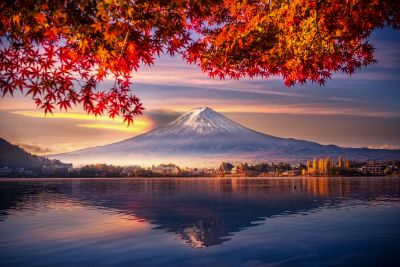
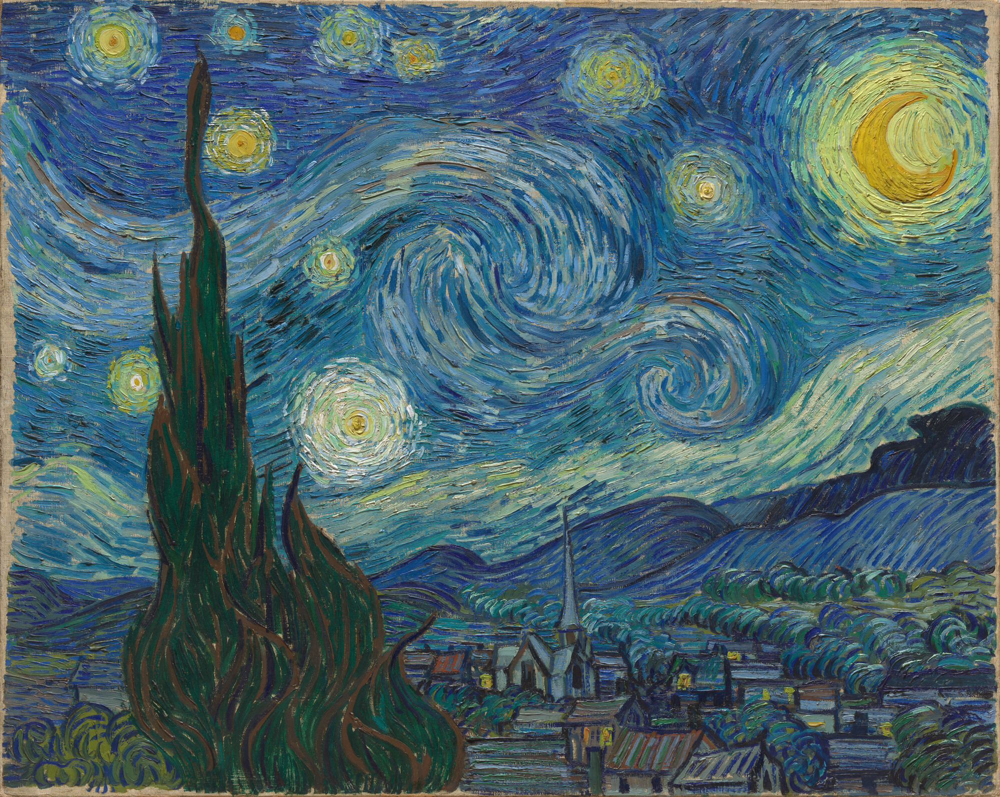
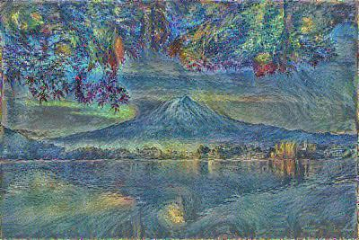
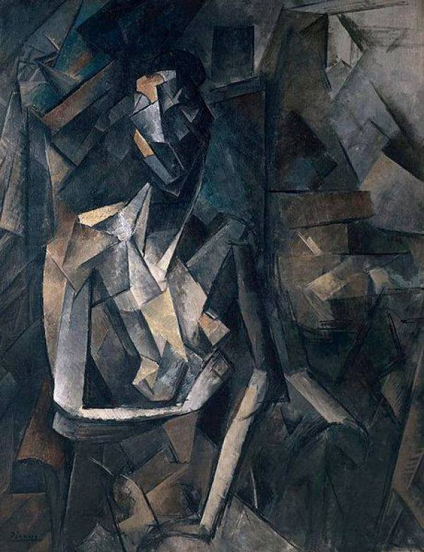
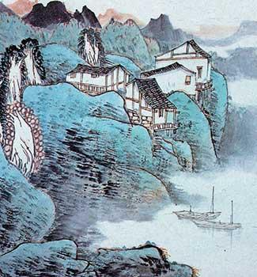
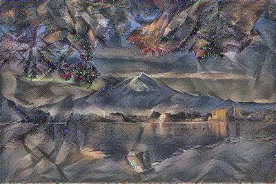
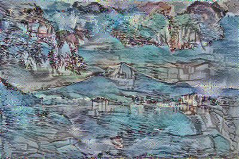

# Neural Image Style Transfer

## Introduction
This looks at the experiments conducted in `Gatys, Leon A., Alexander S. Ecker, and Matthias Bethge. "Image style transfer using convolutional neural networks." Proceedings of the IEEE conference on computer vision and pattern recognition. 2016.` https://www.cv-foundation.org/openaccess/content_cvpr_2016/papers/Gatys_Image_Style_Transfer_CVPR_2016_paper.pdf.

There are two runnable files. `image_reconstruction.py` and `style_transfer.py`.
`image_reconstruction.py` looks at the individual style and content losses for reconstructing images from neural network features (Fig. 1 in the paper). `style_transfer.py` does the actual style transfer.

Content Image

Style Image

Style Transfer

## Usage
To see a reconstruction of the content using only features from block1_conv1 of VGG, run the following

`python3 image_reconstruction.py --image images/starrynight.jpg --layers block1_conv1 --type content --niter 200`

To see the style reconstruction, run

`python3 image_reconstruction.py  --image images/starrynight.jpg --layers block1_conv1 block2_conv1 block3_conv1 block4_conv1 block5_conv1 --type style --niter 1000`

This file will allow you to test how using features from different layers can affect the reconstruction.

To run actual style transfer, run the following

`python3 style_transfer.py --style_image images/starrynight.jpg --content_image images/fuji.jpg --niter 1000 --save_file images/fuji_starrynight.jpg --ratio 1e-4`

where you can specify style and content images and `--ratio` refers to the ratio between the style and content losses. A higher ratio will weight the content more.

## Dependencies 
The code has been tested with the following packages:

* Python3.6
  * numpy 1.18.2
  * matplotlib 3.2.1
  * opencv-python 4.0.0.21  
  * imageio 2.5.0
  * tensorflow 2.1

## Notes
It could be cool to explore using multiple images as style input to get a better style representation. This style transfer technique doesn't seem to work too well on pictures with details (such as those including human faces).

More style transfer images

Styles

Style Transfer

